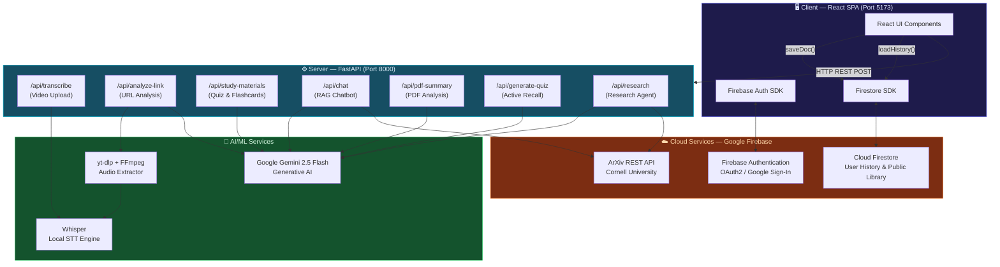
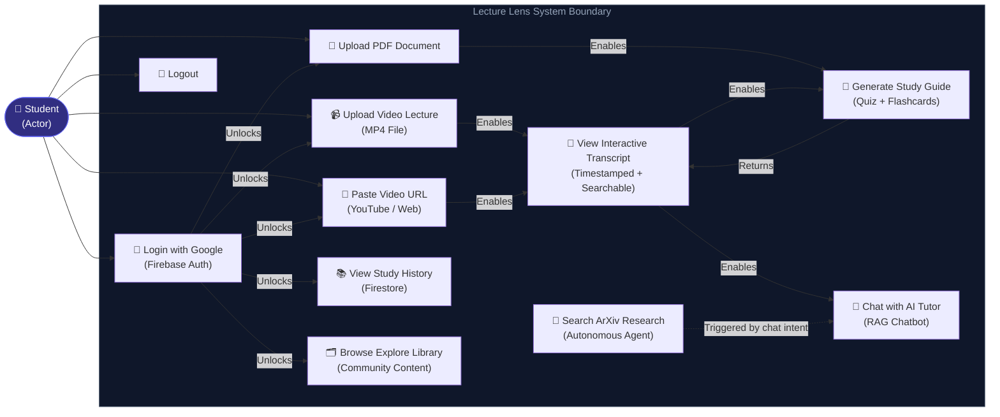
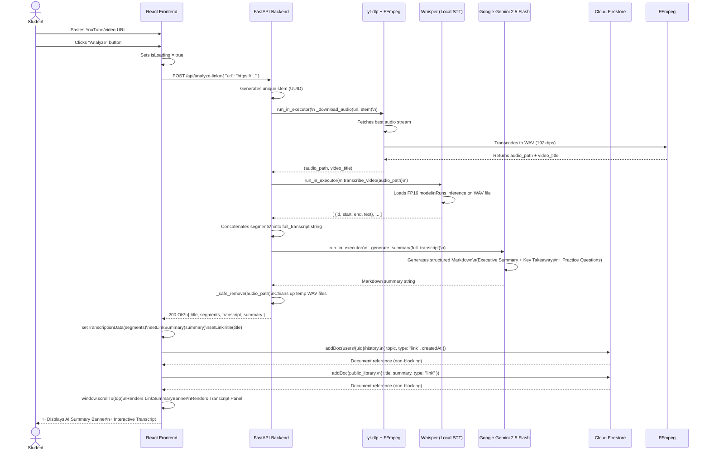

# Lecture Lens — Software Engineering Project Report

> **Course:** Software Engineering | **Project Type:** Capstone / Major Project
> **Date:** April 2026 | **Model:** AI-Powered Study Companion

---

## Table of Contents

1. [Project Overview & Problem Statement](#1-project-overview--problem-statement)
2. [Software Engineering Methodology](#2-software-engineering-methodology)
3. [Tech Stack & Module Breakdown](#3-tech-stack--module-breakdown)
4. [System Architecture & UML Diagrams](#4-system-architecture--uml-diagrams)
5. [Core Feature Implementation](#5-core-feature-implementation)
6. [Security Architecture](#6-security-architecture)
7. [API Reference](#7-api-reference)
8. [Future Scope](#8-future-scope)
9. [Conclusion](#9-conclusion)

---

## 1. Project Overview & Problem Statement

### 1.1 What is Lecture Lens?

**Lecture Lens** is a full-stack, AI-powered academic study companion that transforms the way students interact with learning content. At its core, it enables students to derive structured intelligence from any lecture — whether delivered as a video file, a YouTube/web URL, or a PDF document — and immediately apply that intelligence through interactive quizzes, AI-generated flashcards, a Retrieval-Augmented Generation (RAG) chat assistant, and a live academic research agent powered by the ArXiv scientific database.

The application is built on a modern, cloud-native architecture: a **React + Vite** single-page application (SPA) on the frontend, a **FastAPI (Python)** REST server on the backend, **Firebase** for identity management and persistent cloud storage (Firestore), and **Google Gemini 2.5 Flash** as the primary generative AI engine.

### 1.2 The Problem

Students in the modern educational landscape face a critical challenge: **content overload with limited time for active recall and critical synthesis.** Traditionally, a student who watches a 2-hour lecture recording is expected to:

- Manually scrub through video to find key moments
- Re-transcribe or paraphrase lecture content into notes
- Self-generate quiz questions for exam preparation
- Independently search academic databases (ArXiv, Google Scholar) for related research
- Manage all of this across disconnected tools and platforms

This workflow is **fragmented, time-consuming, and cognitively inefficient.** Tools like YouTube or standard note-taking apps provide no semantic understanding of the material.

### 1.3 The Solution

Lecture Lens addresses this problem through a **unified, AI-first study environment** that automates the mechanical parts of studying and amplifies the intellectual parts. The key value propositions are:

| Traditional Study | With Lecture Lens |
|---|---|
| Manual note-taking | Instant AI-generated structured summary |
| Re-watching entire videos | Searchable, timestamped interactive transcript |
| Self-writing quiz questions | Auto-generated multiple choice quizzes |
| Manual flashcard creation | AI-curated flipcard decks |
| Manual paper searches | Live ArXiv research agent |
| No memory across sessions | Cloud-persisted study history (Firestore) |

---

## 2. Software Engineering Methodology

### 2.1 Agile Iterative Development Model

Lecture Lens was developed using the **Agile Iterative Model**, a software development methodology that emphasises delivering working software in short, incremental cycles called *sprints*, with continuous evaluation and course-correction at each stage.

This approach was chosen because AI-powered features are inherently exploratory — the integration of Gemini's function-calling toolkit, Whisper's transcription outputs, and yt-dlp's audio pipeline required rapid prototyping, testing, and refinement in a way that a rigid Waterfall model could not support.

**Development Sprints:**

| Sprint | Milestone | Key Deliverable |
|---|---|---|
| Sprint 1 | Foundation | Project scaffolding, Vite + FastAPI setup, CORS, `.env` security |
| Sprint 2 | Core Upload | MP4 upload endpoint, Whisper transcription, interactive transcript UI |
| Sprint 3 | AI Study Tools | Gemini integration, quiz generation, flashcard engine |
| Sprint 4 | AI Chat (RAG) | `/api/chat` endpoint with context-aware Gemini RAG chat |
| Sprint 5 | Link Analysis | `yt-dlp` audio extraction pipeline, `/api/analyze-link` endpoint |
| Sprint 6 | PDF Support | `pypdf` text extraction, `/api/pdf-summary` endpoint |
| Sprint 7 | Firebase Auth | Google Firebase Authentication, Login/Logout UI, AuthContext |
| Sprint 8 | Firestore History | Per-user study history, public library with `addDoc`/`getDocs` |
| Sprint 9 | Research Agent | Autonomous ArXiv agent with Gemini function calling |
| Sprint 10 | Hardening | 503 capacity error handling across all AI endpoints |

### 2.2 Client–Server Architecture

Lecture Lens follows a strict **decoupled Client–Server architecture**, a foundational pattern in distributed systems where the client and server operate as independent processes, communicating solely over a well-defined API contract.

```
┌─────────────────────────────────────────────────────────────┐
│                        CLIENT TIER                          │
│   React + Vite SPA  (Port 5173)                            │
│   State: useState / useCallback / useEffect hooks           │
│   Auth: Firebase SDK (client-side)                          │
└──────────────────────────┬──────────────────────────────────┘
                           │  HTTP REST (JSON)
                           │  CORS: http://localhost:5173
┌──────────────────────────▼──────────────────────────────────┐
│                       SERVER TIER                           │
│   FastAPI + Uvicorn  (Port 8000)                           │
│   Async: asyncio + ThreadPoolExecutor (run_in_executor)     │
│   Auth: Firebase Admin SDK (server-side validation)         │
└──────────┬────────────────────────────────────────┬─────────┘
           │                                        │
┌──────────▼──────────┐                 ┌───────────▼─────────┐
│  AI / ML SERVICES   │                 │  CLOUD SERVICES     │
│  - Gemini 2.5 Flash │                 │  - Firebase Auth     │
│  - Whisper (local)  │                 │  - Firestore DB      │
│  - yt-dlp + FFmpeg  │                 │  - ArXiv API         │
└─────────────────────┘                 └─────────────────────┘
```

### 2.3 Asynchronous Non-Blocking Design

A critical engineering decision was making all heavy I/O operations **non-blocking** to prevent the FastAPI event loop from freezing. Since Whisper, yt-dlp, and the Gemini SDK are all synchronous (blocking) libraries, every long-running operation is offloaded to a thread pool executor:

```python
# Pattern used across all heavy endpoints
loop = asyncio.get_event_loop()
result = await loop.run_in_executor(None, synchronous_function, *args)
```

This ensures the server remains responsive to other incoming requests while a transcription or Gemini summarization is in progress.

---

## 3. Tech Stack & Module Breakdown

### 3.1 Frontend Layer

| Technology | Version | Role |
|---|---|---|
| **React** | 18.x | Component-based UI, state management |
| **Vite** | 5.x | Build tool, dev server (HMR), bundler |
| **Tailwind CSS** | 3.x | Utility-first styling, dark-mode design system |
| **react-markdown** | Latest | Renders AI-generated Markdown responses in-browser |
| **remark-gfm** | Latest | GitHub Flavored Markdown (tables, strikethrough) |
| **Firebase SDK** | 10.x | Client-side Auth + Firestore real-time database |

**Key Frontend Components:**

| Component | File | Responsibility |
|---|---|---|
| `AppContent` | `App.jsx` | Auth guard — renders Login or Dashboard |
| `Dashboard` | `App.jsx` | Main application shell, state orchestration |
| `LinkAnalyzer` | `LinkAnalyzer.jsx` | URL paste input, calls `/api/analyze-link` |
| `VideoUploader` | `VideoUploader.jsx` | MP4 drag-and-drop, calls `/api/transcribe` |
| `PdfUploader` | `PdfUploader.jsx` | PDF upload, calls `/api/pdf-summary` |
| `VideoPlayer` | `VideoPlayer.jsx` | HTML5 player with programmatic seek via `seekTime` prop |
| `ExploreLibrary` | `components/ExploreLibrary.jsx` | Bento-grid curated content library |
| `Login` | `components/Login.jsx` | Firebase Google Sign-In UI |
| `AuthContext` | `context/AuthContext.jsx` | React context for auth state |

### 3.2 Backend Layer

| Technology | Version | Role |
|---|---|---|
| **FastAPI** | 0.111.x | Async REST API framework |
| **Uvicorn** | Latest | ASGI server runtime |
| **Python** | 3.11+ | Core backend language |
| **yt-dlp** | Latest | Audio/video stream extraction from URLs |
| **FFmpeg** | System | Audio transcoding to WAV format |
| **Whisper** (OpenAI) | Local | Speech-to-text transcription engine |
| **pypdf** | Latest | PDF text extraction |
| **arxiv** | Latest | Python client for the ArXiv REST API |
| **python-dotenv** | Latest | Secure `.env` environment variable loading |

**Backend API Endpoints:**

| Method | Endpoint | Description |
|---|---|---|
| `POST` | `/api/transcribe` | Upload `.mp4` → Whisper transcription |
| `POST` | `/api/analyze-link` | URL → yt-dlp → Whisper → Gemini summary |
| `POST` | `/api/study-materials` | Transcript → Gemini quiz + flashcards |
| `POST` | `/api/chat` | RAG chat with ArXiv function-calling tool |
| `POST` | `/api/pdf-summary` | PDF upload → pypdf → Gemini summary |
| `POST` | `/api/generate-quiz` | Document text → Active Recall deck |
| `POST` | `/api/research` | Autonomous ArXiv research agent |

### 3.3 Cloud & AI Layer

| Service | Provider | Role |
|---|---|---|
| **Firebase Authentication** | Google | OAuth2/Google Sign-In, user session management |
| **Cloud Firestore** | Google | Per-user study history, public community library |
| **Gemini 2.5 Flash API** | Google DeepMind | Text summarization, quiz/flashcard generation, RAG chat |
| **Gemini Function Calling** | Google DeepMind | Agentic tool-use (ArXiv search decision-making) |
| **ArXiv API** | Cornell University | Live scientific paper search and metadata retrieval |

**Gemini Model Configuration:**

```python
GEMINI_MODEL = 'gemini-2.5-flash'

# Thinking budget disabled for low-latency responses
_NO_THINK = types.GenerateContentConfig(
    thinking_config=types.ThinkingConfig(thinking_budget=0)
)
```

---

## 4. System Architecture & UML Diagrams

### 4.1 System Architecture Diagram

The following diagram illustrates how all system components interconnect, from the user's browser to the external AI and cloud services.



---

### 4.2 Use Case Diagram

The following diagram models all interactions a **Student** (the primary actor) can perform within the Lecture Lens system.



---

### 4.3 Sequence Diagram — "Paste Link" Feature

This sequence diagram details the precise, step-by-step interaction chain triggered when a student analyses a video URL (the `analyze-link` feature), one of the most architecturally complex flows in the application.



---

## 5. Core Feature Implementation

### 5.1 Video Transcription Engine

The transcription pipeline leverages **OpenAI Whisper** running locally. An MP4 file is uploaded to the `/api/transcribe` endpoint, saved temporarily to `uploads/`, and passed to the `transcribe_video()` function. Whisper processes the audio in the GPU/CPU thread pool and returns a list of timestamped segments, each containing a `start`, `end`, and `text` field. These are rendered in the frontend as a clickable, searchable transcript that drives the video player's `seekTime` prop.

### 5.2 Link Analysis Pipeline

The most complex feature. When a URL is submitted to `/api/analyze-link`, the backend:

1. Generates a UUID-based file stem to prevent naming conflicts
2. Launches `yt-dlp` in a thread executor to download and transcode the best available audio stream to WAV via FFmpeg
3. Passes the WAV file to Whisper for transcription
4. Sends the full transcript to Gemini 2.5 Flash with a structured prompt demanding **Executive Summary**, **Key Takeaways**, and **Practice Questions**
5. Cleanly removes all temporary files using a `_safe_remove()` helper that retries on Windows `WinError 32` (file-in-use) errors

### 5.3 RAG-Powered AI Chat

The `/api/chat` endpoint implements a **Retrieval-Augmented Generation (RAG)** pattern. The full transcript (the "knowledge base") is injected into the system instruction of every Gemini call. The model operates in one of three modes based on the user's intent, determined autonomously by Gemini:

- **Document Mode** — Answers questions strictly from the transcript context
- **General Knowledge Mode** — Answers broad academic questions from training data
- **Research Paper Mode** — Invokes the `search_academic_papers` function tool to fetch live ArXiv results

### 5.4 Autonomous Research Agent

The `/api/research` endpoint implements a **Gemini Function Calling agentic loop**. Gemini is provided with a `search_arxiv_papers` tool declaration. When the user asks a research query, Gemini autonomously decides to invoke this tool, the backend executes the `arxiv` Python client against Cornell's API, and the results are returned to Gemini as `FunctionResponse` parts. Gemini then synthesises the real paper data into a formatted Markdown report. This loop continues until Gemini produces a final text response with no further tool calls.

### 5.5 Firebase Authentication & Firestore

Authentication is handled via **Firebase Google OAuth2**. The `AuthContext` React context wraps the entire app, and the `AppContent` component acts as an auth guard — unauthenticated users see only the `Login` component. Upon successful authentication, the user's `uid` is used as the primary key for a nested Firestore collection (`users/{uid}/history`) that stores all study activity with server-side timestamps. A separate `public_library` collection acts as a community knowledge base.

### 5.6 Error Handling — AI Capacity Management

All Gemini endpoints implement a standardised 503 capacity handler to gracefully manage Google's `RESOURCE_EXHAUSTED` and `SERVICE UNAVAILABLE` errors:

```python
def _is_503(exc: Exception) -> bool:
    msg = str(exc).lower()
    return "503" in msg or "service unavailable" in msg \
           or "overloaded" in msg or "resource_exhausted" in msg

def _capacity_response() -> JSONResponse:
    return JSONResponse(
        status_code=503,
        content={"error": "capacity", "detail": _CAPACITY_MSG}
    )
```

The frontend intercepts `res.status === 503` on every AI call and renders a user-friendly inline message instead of crashing.

---

## 6. Security Architecture

All sensitive credentials are strictly managed through environment variables and excluded from version control.

| Concern | Mitigation Strategy |
|---|---|
| **API Keys** | Stored in `.env` (backend), loaded via `python-dotenv`, never committed |
| **Firebase Config** | Non-secret SDK config stored in `firebase.js`; service account key excluded |
| **Git Security** | `.gitignore` excludes `.env`, `.venv/`, `uploads/`, `*.log`, `serviceAccountKey.json` |
| **CORS** | FastAPI middleware restricts origins to `http://localhost:5173` only |
| **File Uploads** | Temp files are UUID-named and cleaned up immediately post-processing |
| **Auth Guard** | Firestore writes are scoped to `users/{uid}` — users can only write their own data |

---

## 7. API Reference

### `POST /api/analyze-link`

**Request Body:**
```json
{ "url": "https://www.youtube.com/watch?v=..." }
```

**Success Response (200):**
```json
{
  "title": "Video Title from yt-dlp",
  "segments": [
    { "id": 0, "start": 0.0, "end": 4.2, "text": "Welcome to this lecture..." }
  ],
  "transcript": "Welcome to this lecture ...",
  "summary": "## 1. Executive Summary\n..."
}
```

**Capacity Error (503):**
```json
{ "error": "capacity", "detail": "Google's AI servers are currently at max capacity..." }
```

---

### `POST /api/chat`

**Request Body:**
```json
{
  "transcript": "Full document text...",
  "question": "What is the main idea?"
}
```

**Success Response (200):**
```json
{ "answer": "Based on the transcript, ..." }
```

---

### `POST /api/research`

**Request Body:**
```json
{ "prompt": "Recent papers on transformer architecture" }
```

**Success Response (200):**
```json
{
  "answer": "### 1. Attention Is All You Need\n**Authors:** Vaswani et al.\n..."
}
```

---

## 8. Future Scope

Lecture Lens has a solid technical foundation that enables several high-impact extensions in future development cycles:

### 8.1 Retrieval-Augmented Generation (RAG) for Global Library Search

The current public library stores summarised content in Firestore but is not semantically searchable. A future iteration would implement a **vector embedding pipeline** using Google's `text-embedding-004` model or `sentence-transformers`. Each document summary would be converted to a high-dimensional embedding vector and stored in a vector database (e.g., **Pinecone**, **Weaviate**, or Firebase's upcoming vector search). This would enable students to search the community library using semantic similarity — e.g., *"find documents about neural networks"* — rather than only exact keyword matches, creating a true knowledge graph across all user-uploaded content.

### 8.2 OCR for Slide Extraction

Many academic lectures are delivered as PDF slide decks containing embedded images, diagrams, and figures that the current `pypdf` text extractor cannot process. A future module would integrate **Optical Character Recognition (OCR)** using Google Cloud Vision API or `pytesseract` to extract text from images within PDFs. Combined with Gemini's multimodal capabilities (which can directly analyse image data), this would enable full analysis of scanned lecture slides, handwritten notes, and diagram-heavy academic materials.

### 8.3 Spaced Repetition System (SRS)

Integrate a **Spaced Repetition** algorithm (e.g., SM-2 used by Anki) into the flashcard engine. Rather than displaying flashcards randomly, the system would track each card's performance history in Firestore and schedule reviews at scientifically-optimal intervals. This would dramatically improve long-term knowledge retention for students.

### 8.4 Multi-language Transcription Support

Whisper supports over 95 languages. A UI language selector could be added to allow students to upload lectures in languages other than English, enabling the platform to serve a global academic audience. Gemini would then summarise the transcript in the student's preferred language.

### 8.5 Export & Collaboration

Students could export their AI-generated study guides, quizzes, and flashcard decks as PDF reports using a library like `pdfkit` or `reportlab`. A collaborative workspace feature using Firestore's real-time listener APIs (`onSnapshot`) would allow study groups to share and annotate transcripts together.

---

## 9. Conclusion

Lecture Lens represents a complete, production-grade application of modern software engineering principles applied to a real-world academic problem. The project demonstrates:

- **Clean Architecture:** A strict separation of concerns between a React SPA, a FastAPI REST server, and Firebase cloud services.
- **Agile Delivery:** Iterative, sprint-based development that evolved from a simple transcription tool into a multi-modal AI study platform.
- **Production-Quality AI Integration:** Responsible use of the Google Gemini SDK with an agentic function-calling loop, robust 503 error handling, and non-blocking async execution.
- **Security Best Practices:** Complete credential isolation, CORS hardening, and Firebase-based user-scoped data storage.

The application stands as a comprehensive demonstration of full-stack development, cloud architecture, and applied generative AI — ready for deployment and further academic research.

---

*Report generated for the Lecture Lens project. All code examples are excerpted directly from the production codebase.*
