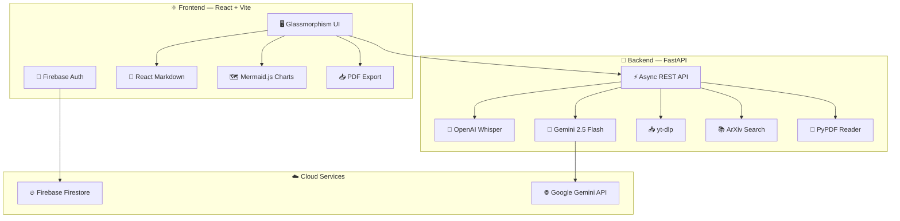
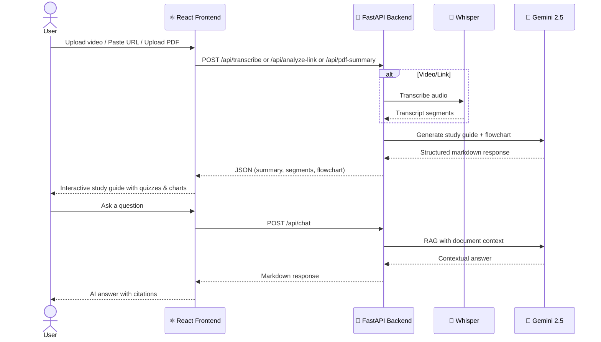

<div align="center">

<!-- Animated Typing Header -->
<a href="https://rashij-17.github.io/lecture_lens/">
  
</a>

<br/>

<!-- Animated Subtitle -->


<br/><br/>

<!-- Badges Row 1 -->
[](https://rashij-17.github.io/lecture_lens/)
[](LICENSE)
[](https://github.com/Rashij-17/lecture_lens/pulls)

<!-- Badges Row 2 — Tech -->


<br/>

<!-- Divider -->


</div>

## 🎬 What is Lecture Lens?

**Lecture Lens** is a full-stack AI-powered study platform that transforms raw lectures, videos, PDFs, and web links into **interactive study guides, flashcards, quizzes, and concept maps** — all in seconds.

> 💡 _Think of it as your personal AI tutor that watches the lecture for you, takes perfect notes, and then quizzes you on everything._

<br/>

## ✨ Features at a Glance

<table>
<tr>
<td width="50%" valign="top">

### 🎥 Video & Link Analysis
Upload `.mp4` files or paste any **YouTube / Vimeo / Twitch** URL. Lecture Lens uses `yt-dlp` + `Whisper` to transcribe, then `Gemini 2.5` to synthesize a complete study guide.

### 📄 PDF Summarization
Drop any academic paper or lecture slides. The AI extracts text and generates a beautifully structured summary with key concepts highlighted.

### 🧠 Active Recall Engine
Automatically generates **MCQ quizzes** and **interactive flashcards** from your materials. Flip cards, test yourself, track your score.

</td>
<td width="50%" valign="top">

### 🗺️ Concept Flowcharts
Dynamically renders **interactive mind maps** using Mermaid.js — visualize how concepts connect at a glance.

### 🤖 Autonomous Research Agent
Deep dive into any topic. The agent autonomously searches **ArXiv** for real academic papers and synthesizes the current research landscape.

### 💬 Contextual AI Chat
Ask questions about your uploaded document. The AI answers from the document context, general knowledge, or fetches live research papers — choosing the right mode automatically.

</td>
</tr>
</table>

<br/>

## 🏗️ Architecture



<br/>

## 🛠️ Tech Stack

<div align="center">

| Layer | Technology | Purpose |
|:---:|:---:|:---|
| **Frontend** |   | SPA with glassmorphism UI |
| **Styling** |  | Custom dark-mode glassmorphism design |
| **Backend** |   | Async API with background processing |
| **AI / ML** |   | Summarization, quiz gen, research |
| **Auth & DB** |  | Google Auth + Firestore database |
| **Tooling** |   | Video download + paper search |
| **Rendering** |   | Rich text + live flowcharts |

</div>

<br/>

## 🚀 Getting Started

### Prerequisites

```
✅ Node.js  v18+
✅ Python   3.10+
✅ FFmpeg   (required for Whisper + yt-dlp)
✅ Gemini API Key (from Google AI Studio)
```

### 1️⃣ Clone the Repository

```bash
git clone https://github.com/Rashij-17/lecture_lens.git
cd lecture_lens
```

### 2️⃣ Backend Setup

```bash
cd backend

# Create virtual environment
python -m venv .venv
.venv\Scripts\activate        # Windows
# source .venv/bin/activate   # macOS/Linux

# Install dependencies
pip install -r requirements.txt

# Configure API key
echo GEMINI_API_KEY=your_key_here > .env

# Launch the server
python -m uvicorn main:app --reload
# ➜ Running on http://127.0.0.1:8000
```

### 3️⃣ Frontend Setup

```bash
cd ../frontend

# Install dependencies
npm install

# Start dev server
npm run dev
# ➜ Running on http://localhost:5173
```

<br/>

## 📖 How It Works



<br/>

## 🎯 API Endpoints

| Method | Endpoint | Description |
|:---:|:---|:---|
| `POST` | `/api/transcribe` | Upload `.mp4` → Whisper transcription |
| `POST` | `/api/analyze-link` | Paste URL → download + transcribe + summarize |
| `POST` | `/api/pdf-summary` | Upload PDF → AI-powered summary |
| `POST` | `/api/study-materials` | Generate quizzes & flashcards from transcript |
| `POST` | `/api/generate-quiz` | Active recall deck (5 flashcards + 5 MCQs) |
| `POST` | `/api/chat` | Contextual Q&A with document RAG |
| `POST` | `/api/research` | Autonomous ArXiv research agent |

<br/>

## 📂 Project Structure

```
lecture_lens/
├── 🎨 frontend/                  # React + Vite SPA
│   ├── src/
│   │   ├── App.jsx               # Main application shell
│   │   ├── App.css               # Glassmorphism design system
│   │   ├── components/
│   │   │   ├── Login.jsx          # Firebase Google Auth
│   │   │   ├── LandingSplash.jsx  # Animated landing video
│   │   │   └── ExploreLibrary.jsx # Community library browser
│   │   ├── context/
│   │   │   └── AuthContext.jsx    # Auth state management
│   │   ├── hooks/
│   │   │   └── usePdfExport.js   # PDF export utility
│   │   ├── VideoUploader.jsx      # Drag & drop video upload
│   │   ├── LinkAnalyzer.jsx       # URL paste & analysis
│   │   ├── PdfUploader.jsx        # PDF upload & summary
│   │   ├── MermaidRenderer.jsx    # Live Mermaid.js charts
│   │   └── firebase.js           # Firebase config
│   └── vite.config.js
│
├── 🐍 backend/                   # FastAPI Python server
│   ├── main.py                   # All API endpoints + Gemini agents
│   ├── transcriber.py            # Whisper transcription wrapper
│   ├── requirements.txt          # Python dependencies
│   ├── Dockerfile                # Container support
│   └── .env                      # API keys (not committed)
│
└── 📄 README.md                  # You are here!
```

<br/>

## 🔒 Security & Privacy

- 🔐 **Authentication** — Firebase Google Auth with protected routes
- 🗝️ **API Keys** — Stored in `.env`, never exposed to frontend or committed
- 🏠 **Local Processing** — Whisper runs locally; only text is sent to Gemini
- 🛡️ **CORS** — Strictly configured for localhost origins only

<br/>

## 🤝 Contributing

Contributions are welcome! Here's how:

1. **Fork** the repository
2. **Create** your feature branch (`git checkout -b feature/amazing-feature`)
3. **Commit** your changes (`git commit -m 'Add amazing feature'`)
4. **Push** to the branch (`git push origin feature/amazing-feature`)
5. **Open** a Pull Request

<br/>

## 📜 License

This project is open source and available under the [MIT License](LICENSE).

<br/>

<div align="center">


### ⭐ Star this repo if you found it useful!

<br/>

Made with ❤️ by [Rashij-17](https://github.com/Rashij-17)

<br/>


</div>
