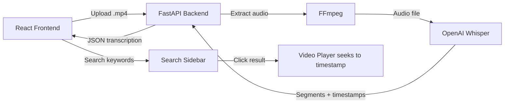

# Lecture-Lens — Implementation Plan

A system that transcribes video lectures and makes them searchable by keyword and timestamp.

## Architecture Overview



---

## User Review Required

> [!IMPORTANT]
> **Whisper Mode — Local vs API**
> The plan uses **local `openai-whisper`** (runs on your machine, no API key needed, free). This requires:
> - **FFmpeg** installed on your system
> - ~1.5 GB disk space for the `base` model (downloaded on first run)
> - A decent CPU (GPU optional but recommended)
>
> **Alternative:** If you prefer the **OpenAI API** (`whisper-1`), it's faster but requires an API key and costs ~$0.006/min. Let me know which you prefer.

> [!WARNING]
> **Tailwind CSS:** You requested Tailwind CSS for the frontend. I'll use **Tailwind CSS v3** via the standard Vite + React setup. Please confirm this is acceptable.

---

## Proposed File Structure

```
software/
├── backend/
│   ├── main.py                  # FastAPI app, routes, CORS
│   ├── transcriber.py           # Whisper transcription logic
│   ├── requirements.txt         # Python dependencies
│   └── uploads/                 # Temp storage for uploaded videos
│
├── frontend/
│   ├── public/
│   ├── src/
│   │   ├── App.jsx              # Main layout (player + sidebar)
│   │   ├── App.css              # Global styles / overrides
│   │   ├── main.jsx             # ReactDOM entry
│   │   ├── index.css            # Tailwind directives + design tokens
│   │   ├── components/
│   │   │   ├── VideoUploader.jsx    # Drag-and-drop upload zone
│   │   │   ├── VideoPlayer.jsx      # HTML5 video player with seek
│   │   │   ├── SearchSidebar.jsx    # Keyword search + results list
│   │   │   └── TranscriptPanel.jsx  # Full scrollable transcript
│   │   └── hooks/
│   │       └── useTranscription.js  # API calls + state management
│   ├── index.html
│   ├── package.json
│   ├── tailwind.config.js
│   ├── postcss.config.js
│   └── vite.config.js
│
└── README.md                    # Setup & run instructions
```

---

## Proposed Changes

### Backend (FastAPI + Whisper)

#### [NEW] [requirements.txt](file:///c:/Users/HP/OneDrive/Desktop/software/backend/requirements.txt)
Dependencies: `fastapi`, `uvicorn[standard]`, `python-multipart`, `openai-whisper`, `ffmpeg-python`

#### [NEW] [main.py](file:///c:/Users/HP/OneDrive/Desktop/software/backend/main.py)
- FastAPI app with CORS middleware (allow `localhost:5173`)
- `POST /api/transcribe` — accepts `.mp4` upload, saves to `uploads/`, calls transcriber, returns JSON
- `GET /api/video/{filename}` — serves uploaded video files for frontend playback
- Response schema:
```json
{
  "filename": "lecture.mp4",
  "segments": [
    {
      "id": 0,
      "start": 0.0,
      "end": 4.52,
      "text": "Welcome to today's lecture on machine learning."
    }
  ]
}
```

#### [NEW] [transcriber.py](file:///c:/Users/HP/OneDrive/Desktop/software/backend/transcriber.py)
- Loads Whisper `base` model (good balance of speed/accuracy)
- `transcribe_video(filepath) -> list[dict]` — runs Whisper on .mp4, returns list of segments with `id`, `start`, `end`, `text`
- Handles FFmpeg extraction automatically (Whisper does this internally)

---

### Frontend (React + Vite + Tailwind CSS)

#### [NEW] React app via `create-vite`
Scaffolded with `npx -y create-vite@latest ./ --template react`

#### Design System — Color Palette
| Token | Color | Usage |
|-------|-------|-------|
| Sage Green | `#8FAE8B` / `#A7C4A0` | Primary buttons, accents, active states |
| Beige | `#F5F0E8` / `#EDE7DB` | Backgrounds, cards |
| Lavender | `#B8A9C9` / `#D4C5E2` | Highlights, search results, hover states |
| Dark Text | `#2D3436` | Primary text |
| Muted Text | `#636E72` | Secondary text, timestamps |

#### [NEW] [VideoUploader.jsx](file:///c:/Users/HP/OneDrive/Desktop/software/frontend/src/components/VideoUploader.jsx)
- Drag-and-drop zone with aesthetic upload animation
- File type validation (`.mp4` only)
- Upload progress bar with sage green fill
- POSTs to `/api/transcribe`

#### [NEW] [VideoPlayer.jsx](file:///c:/Users/HP/OneDrive/Desktop/software/frontend/src/components/VideoPlayer.jsx)
- HTML5 `<video>` element with custom minimal controls
- Accepts `src` URL and `currentTime` prop for programmatic seeking
- Highlights the currently-playing transcript segment
- Styled with rounded corners, subtle shadow on beige background

#### [NEW] [SearchSidebar.jsx](file:///c:/Users/HP/OneDrive/Desktop/software/frontend/src/components/SearchSidebar.jsx)
- Search input with lavender focus ring
- Real-time keyword filtering across all transcript segments
- Each result shows: matching text (keyword highlighted), start timestamp
- Clicking a result → seeks the video player to that timestamp
- Empty and no-results states with friendly illustrations

#### [NEW] [TranscriptPanel.jsx](file:///c:/Users/HP/OneDrive/Desktop/software/frontend/src/components/TranscriptPanel.jsx)
- Full scrollable transcript below/beside the video
- Auto-scrolls to the active segment as video plays
- Each segment shows timestamp badge + text
- Clickable timestamps to seek video

#### [NEW] [useTranscription.js](file:///c:/Users/HP/OneDrive/Desktop/software/frontend/src/hooks/useTranscription.js)
- Custom hook managing: upload state, transcription data, search query, filtered results
- Handles API communication with the backend

#### [NEW] [App.jsx](file:///c:/Users/HP/OneDrive/Desktop/software/frontend/src/App.jsx)
- Two-state layout:
  1. **Upload state** — centered VideoUploader with branding
  2. **Player state** — split layout: VideoPlayer + TranscriptPanel (left), SearchSidebar (right)
- Smooth transitions between states
- Header with "Lecture Lens" branding and sage/lavender gradient accent

---

### Project Root

#### [NEW] [README.md](file:///c:/Users/HP/OneDrive/Desktop/software/README.md)
- Project overview
- Prerequisites (Python 3.9+, Node.js 18+, FFmpeg)
- Backend setup: `pip install -r requirements.txt` → `uvicorn main:app --reload`
- Frontend setup: `npm install` → `npm run dev`
- Usage walkthrough

---

## Open Questions

> [!IMPORTANT]
> 1. **Whisper mode:** Local (free, slower, needs FFmpeg) or OpenAI API (fast, costs money, needs API key)? *I'm defaulting to local.*
> 2. **Do you have FFmpeg installed?** Run `ffmpeg -version` to check. If not, I'll add installation instructions to the README.
> 3. **Python version:** Do you have Python 3.9+ installed? Whisper requires it.

---

## Verification Plan

### Automated Tests
1. Start backend: `uvicorn main:app --reload --port 8000`
2. Start frontend: `npm run dev`
3. Open browser and verify:
   - Upload form renders correctly
   - Color palette matches the sage/beige/lavender spec
   - Upload a short `.mp4` → verify transcription returns
   - Search keywords → verify filtering works
   - Click a result → verify video seeks to correct timestamp

### Manual Verification
- Test with a real lecture video (1–5 min recommended for quick iteration)
- Verify timestamps align with actual speech in the video
- Test responsive layout at different viewport sizes
