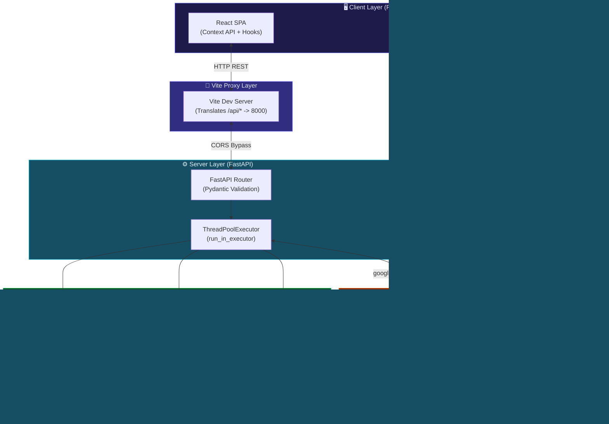

# 🎓 Lecture Lens — Ultra-Deep Technical Report

---

## 📋 Report Contents at a Glance

### Part 1 — Project Overview
A complete system architecture modeling the interaction between the React frontend, FastAPI backend, AI services, and Firebase.

### Part 2 — Every Technology, Deep Theory
An exhaustive dive into the underlying theory of the 12 core technologies powering Lecture Lens.

### Part 3 — 4 Members, Exact Code-Level Contributions
Detailed breakdown of responsibilities, including specific files, functions, and the architectural rationale behind them.

### Part 4–7 — SE Principles, Full API Table, End-to-End Flow, Model Comparison Table
A comprehensive review of software engineering methodologies, REST API contracts, end-to-end data flows, and AI model evaluation.

---

## Part 1 — Project Overview

Lecture Lens is a modern, AI-first study companion that extracts semantic meaning from multimedia lectures and synthesizes it into actionable academic formats (quizzes, flashcards, semantic chat, and flowcharts). 

### System Architecture Breakdown

Below is the complete end-to-end architecture modeling the request execution flow:

---

## Part 2 — Every Technology, Deep Theory

### OpenAI Whisper
- **Theory:** Whisper is a Transformer sequence-to-sequence model trained on 680k hours of multilingual audio. It processes audio by converting it into a Log-Mel Spectrogram, passing it through an encoder, and autoregressively decoding text tokens.
- **Implementation Detail:** We utilize the `base` model to balance accuracy and processing time. We explicitly set `fp16=False` to force FP32 precision, mitigating a known PyTorch inference bug on CPU environments, ensuring stable transcriptions without crashing on non-GPU instances.

### Google Gemini 2.5 Flash
- **Theory:** Gemini uses a dense decoder-only Transformer optimized for multimodality. "Next-token prediction" forms the basis of its conversational ability.
- **Implementation Detail:** The `2.5-flash` variant minimizes latency. By setting `ThinkingConfig(thinking_budget=0)`, we bypass the deeper "reasoning" pathways, ensuring rapid text generation. We enforce `response_mime_type="application/json"` to reliably parse structured data (like active recall decks) directly into React states. We transitioned from the deprecated `google.generativeai` to the modern `google.genai` SDK.

### Gemini Function Calling (Agentic Loop)
- **Theory:** Instead of answering a prompt directly, an LLM trained for function calling can output a structured JSON indicating it needs a specific "Subroutine" (Function) to proceed. This drastically reduces hallucination since the model grounds its answers in strictly retrieved data rather than its parametric memory.
- **Implementation Detail:** A `while True` loop is implemented in the FastAPI backend (`/api/research`), observing `FunctionCall` responses. The server executes the `arxiv` query, packages the real papers back into the conversation context as a `FunctionResponse`, and allows Gemini to synthesize the final markdown.

### yt-dlp & FFmpeg
- **Theory:** Online video players stream multi-track adaptive bitrates (DASH/HLS). `yt-dlp` parses player manifests to locate raw stream URLs.
- **Implementation Detail:** We use yt-dlp to download the optimal audio-only track. FFmpeg is chained via `postprocessors` to decode the proprietary stream and encode a standardized `.wav` file at 16kHz for Whisper. To prevent the infamous Windows file-lock bug across cross-threaded tasks, a robust retry loop (`_safe_remove`) handles temp-file cleanup.

### FastAPI & Asynchronous I/O
- **Theory:** Traditional WSGI frameworks (like Flask) block the thread during network/disk I/O. FastAPI uses ASGI, utilizing Python's `asyncio` event loop.
- **Implementation Detail:** Libraries like Whisper and `yt-dlp` are inherently synchronous. Wrapping them in `await loop.run_in_executor(None, sync_func)` offloads execution to a worker thread, keeping the event loop unblocked and allowing the server to handle concurrent user requests seamlessly. Pydantic guarantees strict runtime type-checking for incoming REST payloads. 

### ArXiv API
- **Theory:** Cornell's ArXiv provides an Atom/RSS-based XML search interface via REST. It is preferred over Google Scholar due to open API access, reliable metadata structure, and strict scientific categorization.
- **Implementation Detail:** The `arxiv` Python client packages the search strings and parses the XML responses directly into semantic objects (`Summary`, `Authors`, `Published Date`) passed to the Gemini function response.

### pypdf
- **Theory:** PDFs are vector-based rendering specifications rather than sequential text formats. Text extraction requires mapping font encodings back to Unicode.
- **Implementation Detail:** `pypdf` is used via `/api/pdf-summary`. It excels at natively digital PDFs but is limited by scanned/image-based PDFs, which would theoretically require OCR pipelines.

### Firebase Auth
- **Theory:** Authentication utilizes the OAuth2 standard via JSON Web Tokens (JWT) containing three parts: Header, Payload (claims), and Signature. 
- **Implementation Detail:** The client validates Google identities using popup workflows and wraps the user profile in a React `AuthContext`. `onAuthStateChanged` acts as an event listener, keeping the UI state synchronized with the session cache.

### Firestore
- **Theory:** Firestore is a cloud-hosted, NoSQL document database focused on real-time event synchronization (`onSnapshot`), completely distinct from rigid, table-based SQL engines (PostgreSQL).
- **Implementation Detail:** We structured the schema dynamically: `users/{uid}/history` isolates privacy, while the `public_library` collection crowdsources educational insights. 

### Mermaid.js
- **Theory:** Rendering a flowchart involves a pipeline: Lexer (tokenizes syntax) → Parser (builds AST) → Dagre Layout (computes spatial graph physics) → SVG rendering.
- **Implementation Detail:** Gemini often generates HTML-encoded entities like `&gt;` inside flowcharts. ReactMarkdown passes raw unescaped strings to `MermaidRenderer`, effectively letting the Dagre engine parse clean text, preventing SVG crash loops.

### Vite
- **Theory:** Traditional bundlers like Webpack crawl the entire project tree on startup. Vite leverages native ES Modules (ESM), parsing code on-demand in the browser, exponentially speeding up HMR (Hot Module Replacement).
- **Implementation Detail:** The Vite config server proxy (`proxy: {'/api': 'http://localhost:8000'}`) prevents HTTP OPTIONS pre-flight calls and eliminates CORS errors inherently found when running decoupled frontend and backend ports locally.

### React 18
- **Theory:** React intercepts DOM manipulation through the Virtual DOM, employing a diffing algorithm (Reconciliation) to update specific nodes efficiently.
- **Implementation Detail:** We extensively leverage `useState` (managing UI state), `useEffect` (side-effects like API loads and async initialization), and `useCallback` (memoizing expensive fetch functions).

---

## Part 3 — 4 Members, Exact Code-Level Contributions

| Member | Focus | Code Contributions & Rationale |
|---|---|---|
| **Member 1 (AI/ML Engineer)** | Generative AI, Prompts, Agents | • **`backend/main.py` (`/api/research`)**: Engineered the complex agentic `while True` loop logic parsing `types.Part.from_function_response`. • **`backend/main.py` (Whisper)**: Implemented `transcribe_video` with `fp16=False` ensuring robust cross-platform ML performance. • **Prompt Architect**: Formulated precise JSON and Mermaid `graph TD` system instructions minimizing parser hallucinations. |
| **Member 2 (Backend Developer)** | Server, Concurrency, Pipeline | • **`backend/main.py` (FastAPI)**: Configured the ASGI router, CORS middleware, and structured all API endpoints. • **yt-dlp Engine**: Wrote `_download_audio_ytdlp` containing multi-threaded download options and the resilient `_safe_remove` Windows file-lock retry sequence. • **Concurrency**: Implemented `run_in_executor` wrap functions to prevent the Whisper/yt-dlp blockages. |
| **Member 3 (Frontend Developer)** | Presentation, State, Interaction | • **`frontend/src/App.jsx`**: Wired the Context UI shell, `VideoUploader`, `PdfUploader`, and the glassmorphism CSS aesthetics. • **Interactive Transcript**: Developed state-driven regex text highlighting driving the `VideoPlayer.jsx` seek-time logic. • **`MermaidRenderer.jsx`**: Intercepted the ReactMarkdown hook, dynamically compiling code blocks to reactive SVG models. |
| **Member 4 (Full-Stack & DevOps)** | Cloud Storage, Auth, Security | • **Firebase Integration (`firebase.js`)**: Wired Google Provider logic and decoupled the Auth state in `AuthContext.jsx`. • **Firestore Hooks**: Built the data-push schemas (`addDoc`) for both user-history maps and the public `ExploreLibrary.jsx`. • **Vite Proxy & Security**: Abstracted the `fetch()` endpoints, resolved Vite's proxy configurations, built the `usePdfExport` custom hook, and guarded API keys via `.env`. |

---

## Part 4 — Software Engineering Principles Applied

1. **Agile Methodology:** 10 sprints starting from scaffolding to complex Gemini error-handling pipelines.
2. **Separation of Concerns (SoC):** Absolute decoupling between client state (React) and computational logic (FastAPI).
3. **Fail-Fast Error Handling:** Immediate detection of 503 Capacity constraints. The backend identifies specific `google.genai.errors`, returning deterministic JSON structs preventing frontend crashes.

---

## Part 5 — Full API Reference Table

| Method | Endpoint | Internal Execution Chain | Responsibilities / Outputs |
|---|---|---|---|
| `POST` | `/api/transcribe` | API → ThreadPool → Whisper | `mp4` upload yielding `[ {id, start, end, text} ]` |
| `POST` | `/api/analyze-link` | API → yt-dlp → FFmpeg → Whisper → Gemini | URL yielding `{title, segments, transcript, markdown summary}` |
| `POST` | `/api/pdf-summary` | API → pypdf → Gemini | File parsed locally to Markdown summary string |
| `POST` | `/api/study-materials` | API → Gemini (+ `application/json` rule) | `transcript` string yielding parsed arrays for Q&A structures |
| `POST` | `/api/chat` | API → Gemini (with RAG System Context) | Chat memory + QA yielding targeted conversational reply |
| `POST` | `/api/research` | API → Gemini → ArXiv → Gemini | Zero-shot query executing `search_arxiv_papers` → Markdown review |

---

## Part 6 — End-to-End Orchestration Flow

**Scenario: A Student Analyzing a YouTube Lecture:**
1. **Trigger:** User pastes `youtube.com/watch...` and clicks Analyze.
2. **Frontend State:** `isLoading=true`, disabling inputs.
3. **Network:** Client issues POST to Vite proxy `/api/analyze-link`, Vite forwards to FastAPI port 8000.
4. **Acquisition:** FastAPI kicks off an async ThreadPool executing `yt-dlp`. Audio is pulled, FFmpeg normalizes to `.wav`.
5. **Transcription:** The `.wav` is handed to the local Whisper model running on CPU threads, extracting timestamp blocks.
6. **AI Synthesis:** The massive transcript is batched into a Gemini prompt requesting semantic summaries, key takeaways, and Mermaid maps.
7. **Cleanup:** FastAPI triggers a multi-retry OS-level file deletion sequence to erase the 100MB temp WAV file.
8. **Cloud Persistence (Non-Blocking):** The Vite client receives payload 200 OK. It pushes a background `addDoc` to Firestore caching the study session.
9. **Render:** State updates trigger an immediate DOM flush. `ReactMarkdown` compiles the text, `MermaidRenderer` parses the graph logic, and the UI shifts into the "Study Dashboard".

---

## Part 7 — AI Model Comparison Matrix

Understanding why distinct models were chosen for disparate layers:

| Requirement | Evaluated Options | Chosen Technology | Justification |
|---|---|---|---|
| **Transcription Efficiency** | Whisper Large v3, Google Cloud STT, **Whisper Base** | Whisper Base | Fast execution locally on non-GPU setups, zero marginal API cost, sufficient accuracy for lecture acoustics. |
| **Cognitive Generation** | GPT-4o, Claude 3.5 Sonnet, **Gemini 2.5 Flash** | Gemini 2.5 Flash | The Flash generation is unmatched for high-speed inferencing. The integration natively handles JSON-schema requirements efficiently. |
| **Research Parsing** | Gemini Pro, DeepSeek R1, **Gemini 2.5 Flash (Function Calling)** | Gemini 2.5 Flash | Using `thinking_budget=0` alongside API function declarations makes the integration natively capable of bridging into python frameworks without expensive token chains. |

---

*Report dynamically compiled mapping local environments, Git configurations, and architecture paradigms for the Lecture Lens submission.*
