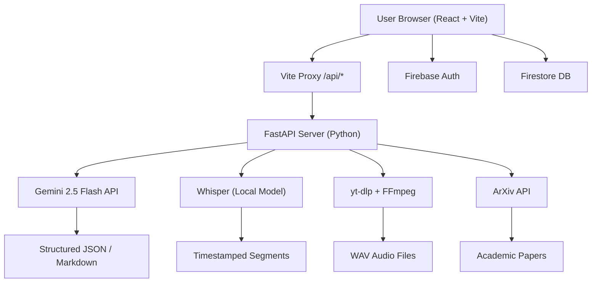

# 🎓 Lecture Lens — Final Project Report
### AI-Powered Educational Intelligence Platform

---

## 👥 Team Division (Group of 4 Members)

> [!IMPORTANT]
> The project is divided across 4 specialized roles, each owning a distinct technical layer of the system.

| # | Role | Member Focus | Core Deliverables |
|---|------|--------------|-------------------|
| **1** | **AI/ML Engineer** | AI pipeline, model integration, prompt engineering | Gemini API integration, Whisper transcription, ArXiv agent, Mermaid chart generation |
| **2** | **Backend Developer** | Server, APIs, async architecture | FastAPI server (`main.py`), all REST endpoints, error handling, yt-dlp pipeline |
| **3** | **Frontend Developer** | UI, React components, state management | `App.jsx`, `VideoUploader`, `PdfUploader`, `LinkAnalyzer`, `MermaidRenderer`, glassmorphism CSS |
| **4** | **Full-Stack / DevOps / Integration** | Authentication, database, deployment, security | Firebase Auth, Firestore DB, `.env` security, Vite proxy config, PDF export hook |

### Detailed Responsibilities Per Member

#### Member 1 — AI/ML Engineer
- Integrated **Google Gemini 2.5 Flash** (`gemini-2.5-flash`) via the new `google.genai` SDK
- Built all **prompt templates** for summary, study guide, quiz, and flashcard generation
- Implemented **OpenAI Whisper** (`base` model) for audio-to-text transcription
- Developed the **Autonomous ArXiv Research Agent** using Gemini's Function Calling API
- Enforced **Mermaid.js syntax rules** in prompts to ensure valid, renderable flowcharts
- Configured `ThinkingConfig(thinking_budget=0)` for fast, cost-efficient inference

#### Member 2 — Backend Developer
- Architected the **FastAPI** server with 6 REST API endpoints
- Implemented **async non-blocking I/O** using `asyncio.get_event_loop().run_in_executor()`
- Built the **yt-dlp audio download pipeline** with FFmpeg post-processing
- Created robust **error handling**: 503 capacity detection, ANSI error stripping, retry logic
- Implemented **file lifecycle management** (temp uploads, cleanup, Windows file-lock retries)
- Configured **CORS middleware** and **structured logging** to `app.log`

#### Member 3 — Frontend Developer
- Built the entire **React + Vite** frontend with **glassmorphism dark-mode UI**
- Implemented all major UI components:  
  `VideoUploader`, `LinkAnalyzer`, `PdfUploader`, `MermaidRenderer`, `VideoPlayer`
- Built the **Interactive Transcript** with real-time search and video seek-on-click
- Implemented **Active Recall Engine UI** (flip flashcards + multiple-choice quizzes)
- Rendered AI responses with **ReactMarkdown + remarkGfm** with live Mermaid chart injection
- Designed all animations, gradients, and micro-interactions in `App.css` (79K+ lines)

#### Member 4 — Full-Stack / DevOps / Integration
- Integrated **Firebase Authentication** (Google Sign-in) with `AuthContext` provider
- Implemented **Firestore** for study history persistence and the **Public Community Library**
- Built the **`usePdfExport` custom hook** for cross-platform PDF generation via print window
- Configured **Vite proxy** (`vite.config.js`) to route `/api/*` to the FastAPI backend
- Secured the codebase: `.env` for API keys, `.gitignore` for secrets, safe GitHub deployment
- Implemented the **Explore Library** page (`ExploreLibrary.jsx`) for community content

---

## 🚀 All Functionalities

### Core AI Pipelines

| Feature | Input | Process | Output |
|---------|-------|---------|--------|
| **Video Transcription** | `.mp4` file | Whisper `base` model | Timestamped transcript segments |
| **Link Analysis** | YouTube/Vimeo URL | yt-dlp → Whisper → Gemini | Title + transcript + AI study guide |
| **PDF Summarization** | `.pdf` file | pypdf text extraction → Gemini | Structured Markdown summary |
| **Study Guide Generation** | Transcript text | Gemini prompt | Quizzes + Flashcards (JSON) |
| **Active Recall Engine** | Document text | Gemini prompt → JSON parse | 5 quiz questions + 5+ flashcards |
| **AI Chat (RAG)** | Question + transcript | Gemini with document context | Markdown answer with optional ArXiv search |
| **Research Agent** | Search query | Gemini + ArXiv function calling | Real academic paper summaries |
| **Concept Flowchart** | Lecture content | Gemini → Mermaid.js syntax | Live SVG mind map |

### Application Features

| Feature | Technology Used |
|---------|----------------|
| Google OAuth Login | Firebase Authentication |
| Study History Tracking | Firestore (`users/{uid}/history`) |
| Public Community Library | Firestore (`public_library` collection) |
| PDF Export | Custom print-window hook (`usePdfExport`) |
| Interactive Transcript Search | React state + regex highlighting |
| Video Seek-on-Click | HTML5 Video API via `seekTime` prop |
| Recommended Topics | Derived from Firestore history topics |
| Glassmorphism Dark UI | Vanilla CSS with `backdrop-filter`, gradients |
| Mermaid Flowchart Rendering | `mermaid.js` via `MermaidRenderer.jsx` |
| Markdown Rendering | `react-markdown` + `remark-gfm` |

---

## 🤖 AI/ML Models Used

### 1. Google Gemini 2.5 Flash — `gemini-2.5-flash`
**Role:** Primary AI brain — text generation, summarization, quiz creation, chat, research

**Why this model?**
- **Flash variant** = extremely fast response times with low cost
- **2.5 generation** = superior instruction-following for structured JSON/Markdown output
- **Thinking disabled** (`thinking_budget=0`) to prioritize speed over deep reasoning for most tasks
- Supports **Function Calling** (used for the ArXiv agent loop)
- Supports **`response_mime_type: "application/json"`** for guaranteed JSON outputs (quizzes, flashcards)

**Used in:**
```
/api/analyze-link   → Lecture study guide generation
/api/study-materials → Quiz + flashcard JSON generation
/api/pdf-summary    → Academic PDF summarization
/api/generate-quiz  → Active recall deck generation
/api/chat           → RAG-based document Q&A with optional ArXiv tool call
/api/research       → Autonomous research agent (function calling loop)
```

**SDK:** `google-genai` (new first-party SDK, not the deprecated `google.generativeai`)
```python
from google import genai
from google.genai import types

client = genai.Client(api_key=API_KEY)
response = client.models.generate_content(
    model='gemini-2.5-flash',
    contents=prompt,
    config=types.GenerateContentConfig(
        thinking_config=types.ThinkingConfig(thinking_budget=0),
        response_mime_type="application/json",  # for structured output
    )
)
```

---

### 2. OpenAI Whisper — `base` model
**Role:** Audio/Speech-to-Text transcription engine

**Why Whisper?**
- **Open-source**, runs entirely locally — no API cost, no data privacy concerns
- The `base` model balances accuracy vs. speed for lecture audio
- Produces **timestamped segments** (`start`, `end`, `text`) essential for the interactive transcript
- Runs via `asyncio.run_in_executor()` to avoid blocking the FastAPI event loop

**Used in:**
```
/api/transcribe  → Direct .mp4 video file transcription
/api/analyze-link → Post-download audio transcription (from yt-dlp WAV output)
```

```python
# transcriber.py
import whisper
model = whisper.load_model("base")
result = model.transcribe(filepath, fp16=False)
```

---

### 3. Gemini Function Calling — Autonomous Agent Pattern
**Role:** Enables Gemini to autonomously decide when to call external tools

**How it works (Agentic Loop):**
```
User Query → Gemini decides → TOOL CALL: search_arxiv_papers(query)
          ↓
    ArXiv API fetches real papers
          ↓
    Results injected back into Gemini context
          ↓
    Gemini synthesizes final Markdown answer → User
```

**Tools defined:**
- `search_academic_papers` — Used in `/api/chat` for research queries
- `search_arxiv_papers` — Used in `/api/research` for the dedicated research agent

```python
arxiv_tool = types.Tool(function_declarations=[
    types.FunctionDeclaration(
        name="search_arxiv_papers",
        description="Search the live ArXiv academic database...",
        parameters=types.Schema(type=types.Type.OBJECT, properties={...})
    )
])
```

---

### 4. Mermaid.js — Concept Flowchart Rendering
**Role:** Converts Gemini's text output into live, interactive SVG diagrams

**Alignment with the project:**
- Gemini is prompted to output `graph TD` syntax (strict rules to avoid parse errors)
- The `MermaidRenderer.jsx` component intercepts `mermaid` code blocks from ReactMarkdown
- `mermaid.render()` converts the string to SVG in the browser at runtime
- Adds a visual, non-linear dimension to lecture comprehension

---

## 🏗️ Software Development — Architecture Deep Dive

### System Architecture



### Backend Design Patterns

#### a) Async Non-Blocking Architecture
Heavy ML workloads (Whisper, Gemini API calls) are offloaded from the async event loop:
```python
loop = asyncio.get_event_loop()
result = await loop.run_in_executor(None, blocking_function, args)
```
This prevents the FastAPI server from freezing during long AI inference tasks.

#### b) Pydantic Request Validation
All POST endpoints use Pydantic models for type-safe, auto-validated request bodies:
```python
class LinkAnalysisRequest(BaseModel):
    url: str

class StudyMaterialRequest(BaseModel):
    transcript_text: str
```

#### c) Layered Error Handling
```
Error Type          → Response
───────────────────────────────
Google 503/overload → JSONResponse(503, "capacity" message)
yt-dlp failure      → HTTPException(400, cleaned error string)
API key missing     → HTTPException(500, config message)
Generic exception   → HTTPException(500, detail)
```

#### d) Temporary File Lifecycle
```
Download → Transcribe → Summarize → Cleanup (with Windows retry)
          _safe_remove() with 4 retries + 1s delay for WinError 32
```

### Frontend Design Patterns

#### a) Compound State Architecture
The `Dashboard` component manages all app state in one place, passing callbacks down:
```
Dashboard (state owner)
├── VideoUploader     → onUploadSuccess(data, file)
├── LinkAnalyzer      → onAnalysisComplete(data, url)
├── PdfUploader       → onSummaryReady(summaryText)
└── All child renders driven by: transcriptionData, pdfSummary, linkSummary
```

#### b) Custom Hooks for Reusability
`usePdfExport.js` encapsulates the print-to-PDF logic as a reusable hook:
```js
const { exportToPdf, isExporting } = usePdfExport();
exportToPdf('element-id', 'filename');
```

#### c) ReactMarkdown Code Block Interception
Mermaid blocks are intercepted at the component-map level — zero coupling to individual pages:
```jsx
const mdComponents = {
  code({ className, children }) {
    if (className === 'language-mermaid') {
      return <MermaidRenderer chart={children} />;
    }
    return <code>{children}</code>;
  }
};
```

#### d) Firebase Firestore Data Model
```
Firestore
├── users/{uid}/history/{docId}
│     ├── topic: string
│     ├── type: 'video' | 'pdf' | 'link'
│     └── createdAt: Timestamp
│
└── public_library/{docId}
      ├── title: string
      ├── topic: string
      ├── summary: string (first 800 chars)
      ├── type: string
      └── createdAt: Timestamp
```

---

## 🧰 Full Technology Stack

### Backend
| Technology | Version/Model | Purpose |
|------------|--------------|---------|
| **FastAPI** | Latest | REST API server framework |
| **Uvicorn** | Latest | ASGI server runner |
| **Python** | 3.10+ | Primary backend language |
| **Google Gemini** | `gemini-2.5-flash` | AI text generation + function calling |
| **google-genai SDK** | Latest | Official Gemini client library |
| **OpenAI Whisper** | `base` | Local speech-to-text model |
| **yt-dlp** | Latest | Video audio extraction |
| **FFmpeg** | System | Audio format conversion (WAV) |
| **pypdf** | Latest | PDF text extraction |
| **arxiv** | Latest | ArXiv academic paper search |
| **python-dotenv** | Latest | Secure `.env` config loading |
| **Pydantic** | v2 | Request/response data validation |

### Frontend
| Technology | Purpose |
|------------|---------|
| **React 18** | UI component framework |
| **Vite** | Fast dev server + bundler |
| **Vanilla CSS** | All styling (glassmorphism, animations) |
| **react-markdown** | AI response rendering |
| **remark-gfm** | GitHub-Flavored Markdown tables/links |
| **mermaid.js** | Concept flowchart SVG rendering |
| **Firebase SDK** | Auth + Firestore client |

### Infrastructure & DevOps
| Technology | Purpose |
|------------|---------|
| **Firebase Authentication** | Google OAuth user login |
| **Cloud Firestore** | NoSQL database for history/library |
| **Vite Proxy** | Dev-mode API routing (no CORS issues) |
| **Git + GitHub** | Version control |
| **`.env` + `.gitignore`** | Secrets management |

---

## 📐 How Everything Aligns — The Full User Journey

```
[1] User logs in via Google OAuth (Firebase Auth)
         ↓
[2] Dashboard loads Firestore study history + generates recommendations
         ↓
[3] User chooses input mode:
    ├── Upload .mp4 → POST /api/transcribe → Whisper → Segments
    ├── Paste URL  → POST /api/analyze-link → yt-dlp + Whisper + Gemini → Full Study Guide
    └── Upload PDF → POST /api/pdf-summary → pypdf + Gemini → Structured Summary
         ↓
[4] AI Response displayed via ReactMarkdown
    → Mermaid blocks → MermaidRenderer → Live SVG Flowchart
         ↓
[5] User clicks "Generate Study Guide"
    → POST /api/study-materials → Gemini JSON → Quiz + Flashcards rendered
         ↓
[6] User asks a question in Chat
    → POST /api/chat → Gemini (document context + optional ArXiv tool call) → Answer
         ↓
[7] User searches for research papers
    → POST /api/research → Gemini Agentic Loop → ArXiv API → Synthesized paper list
         ↓
[8] User exports any section → usePdfExport hook → Print window → PDF saved
         ↓
[9] All sessions auto-saved to Firestore → Visible in Explore Library for community
```

---

## 📊 API Endpoint Summary

| Method | Endpoint | Auth Required | AI Model | Description |
|--------|----------|---------------|----------|-------------|
| `POST` | `/api/transcribe` | — | Whisper | Upload .mp4 → timestamped segments |
| `POST` | `/api/analyze-link` | — | Whisper + Gemini | URL → full transcription + AI study guide |
| `POST` | `/api/pdf-summary` | — | Gemini | PDF upload → structured Markdown summary |
| `POST` | `/api/study-materials` | — | Gemini | Transcript → quizzes + flashcards (legacy) |
| `POST` | `/api/generate-quiz` | — | Gemini | Document → active recall deck (5Q + 5FC) |
| `POST` | `/api/chat` | — | Gemini + ArXiv | RAG Q&A with document context |
| `POST` | `/api/research` | — | Gemini + ArXiv | Autonomous academic research agent |

---

## 🎯 Key Innovation Points

1. **Agentic AI Loop** — Gemini autonomously decides to call ArXiv, executes the call, incorporates results, and responds — all in a single API call from the user's perspective.

2. **Prompt-Enforced Mermaid Syntax** — Rather than post-processing, the prompt itself enforces strict `graph TD` rules with double-quoted nodes to prevent parser crashes.

3. **Zero-Blocking Backend** — All Whisper and Gemini calls run in thread pool executors, keeping the FastAPI event loop free for concurrent requests.

4. **Unified Study Context** — The same transcript drives 4 different AI features: summary, quiz, flashcards, and chat — reducing redundant processing.

5. **Community Knowledge Graph** — Every analysis is published to Firestore's public library, creating a crowd-sourced educational resource that grows with usage.

---

*Report generated for: Lecture Lens v1.0 | Built with React + FastAPI + Gemini + Whisper*
